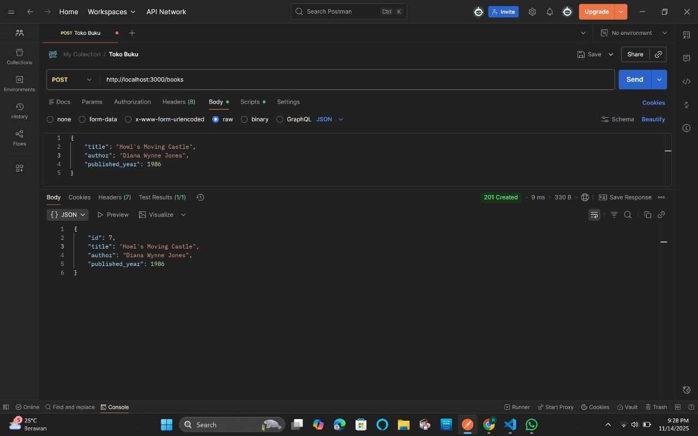
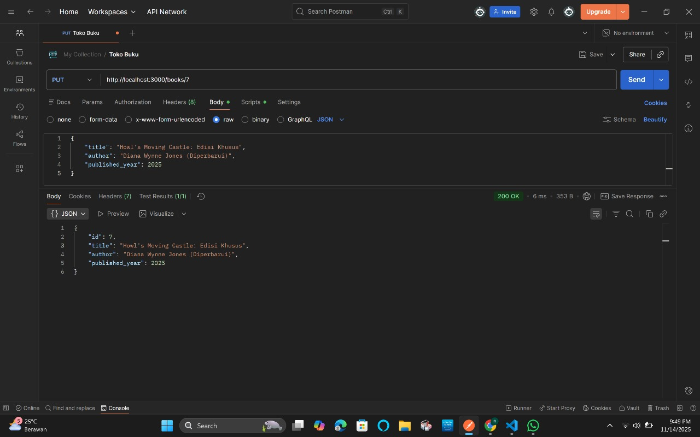
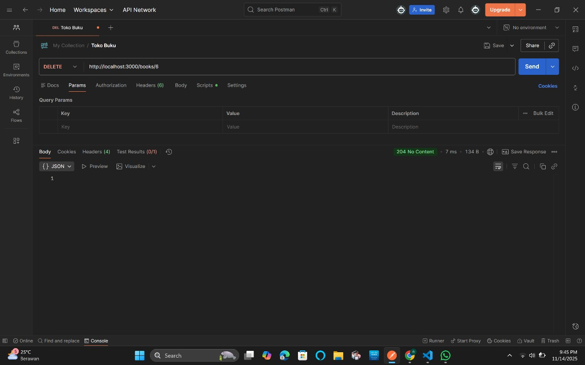
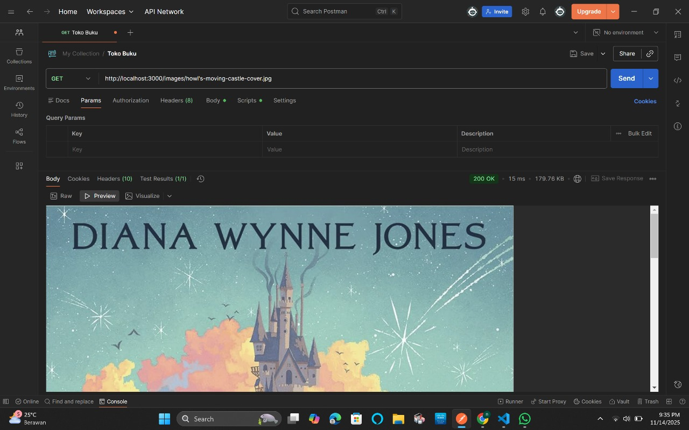

📚 REST API TOKO BUKU

Tujuan Proyek
Proyek ini mengimplementasikan REST API lengkap untuk mengelola koleksi buku (`/books`) menggunakan Express.js. Semua persyaratan wajib telah diselesaikan, meliputi: CRUD Lengkap, Express Router, Middleware Kustom (Logging dan Validasi), dan Global Error Handling.

1. Pengujian Fungsionalitas Utama (CRUD)
Berikut adalah bukti pengujian untuk semua operasi CRUD yang berhasil.

1.1. GET /books (Read All)
Mengambil semua koleksi buku. (Status 200 OK).

1.2. GET /books/:id (Read by ID)
Mengambil detail buku spesifik (`/books/1`) (Status 200 OK).

1.3. POST /books (Create)
Menambahkan buku baru ke koleksi (Status 201 Created).

1.4. PUT /books/:id (Update)
Memperbarui detail buku yang sudah ada (Status 200 OK).

1.5. DELETE /books/:id (Delete)
Menghapus buku dari koleksi (`/books/6`) (Status 204 No Content).

2. Pengujian Error Handling dan Validasi
Bagian ini membuktikan middleware kustom berfungsi menangani kesalahan.

2.1. 400 Bad Request (Middleware Validasi)
Membuktikan middleware validasi (`validation.js`) menolak input tanpa `author` atau `title`.

2.2. 404 Not Found (Data Tidak Ada)
Membuktikan penanganan data yang tidak ditemukan (`/books/9`).

2.3. 500 Internal Server Error
Membuktikan Global Error Handler (middleware 4 argumen) berfungsi saat server crash tak terduga.

3. Pengujian Middleware Kustom & Statis

3.1. File Statis (/images)
Membuktikan express.static berfungsi memuat gambar cover buku.

3.2. Middleware Logger
Membuktikan middleware logger mencatat setiap permintaan ke konsol server.
